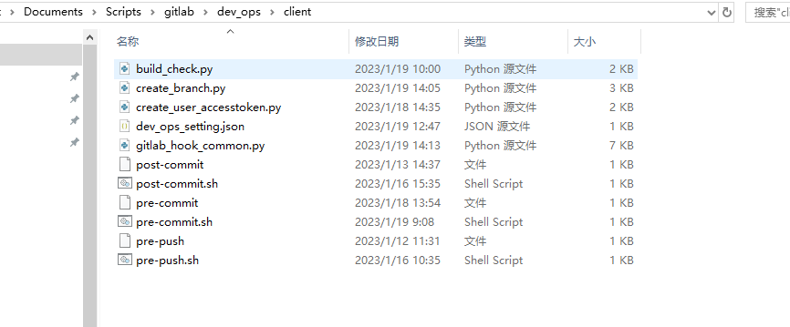
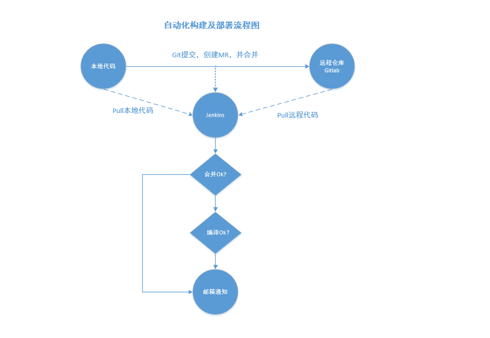
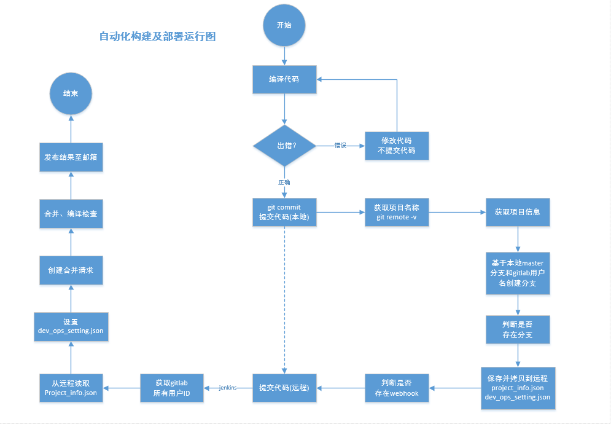
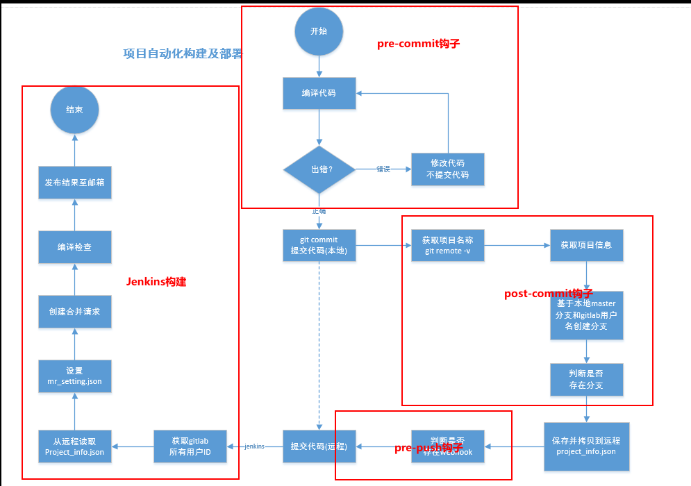
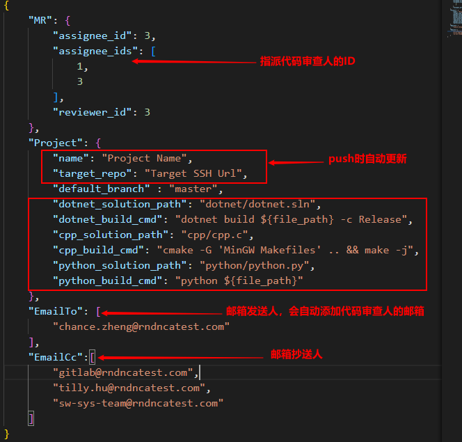
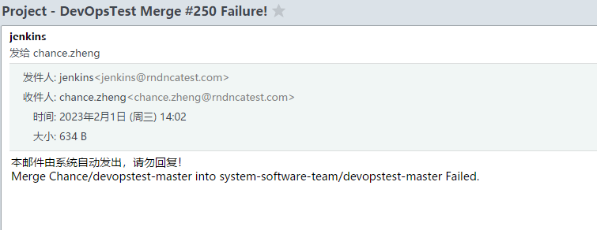
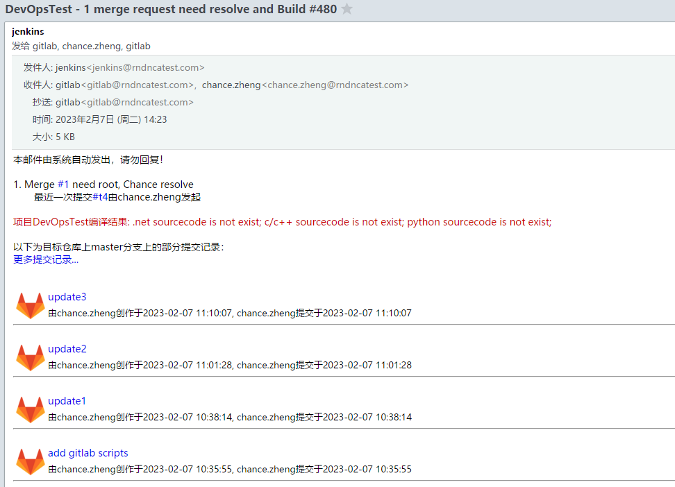

# 关于Gitlab与Jenkins上自动化构建及项目发布与部署的说明
### **包含以下4个功能**
- 代码提交前的编译检查（格式、错误、语法等，支持.net、c/c++、python命令编译）
- 自动创建MR
- 合并代码后的编译检查，并将结果发至邮箱
- 将安装包发布至指定位置 

<br/>

## **使用步骤：**

## 1. 首次创建项目推送到gitlab上时 
### 1.1 创建gitlab文件夹
### 1.2 下载[脚本文件夹](http://192.168.9.90:9092/systemsoftwareteam/documents/-/blob/master/Scripts/gitlab/dev_ops/client)，并将里面所有文件拷贝至上述gitlab文件夹中

### 1.3 将pre-push拷贝到.git/hooks/下，然后再推送到远程仓库
### 1.4 添加忽略文件.gitignore，并在其中添加内容
```
gitlab/commit_info.json
gitlab/users.json
```
详细示例可查看[DevOpsTest](http://192.168.41.140:1080/system-software-team/devopstest)

## 2. clone项目时
### 2.1 设置windows隐藏的项目可见，若clone的是fork到自己名下的项目，将gitlab文件夹下pre-commit、post-commit、pre-push拷贝到.git/hooks/下，若clone的是目标项目而非fork到自己名下的项目，则只需拷贝pre-push到.git/hooks/下即可
### 2.2 fork项目并clone项目后第一次修改代码在master分支上修改，提交时会自动创建一个分支（以gitlab上的username命名）

## 3. 安装依赖环境
### 3.1 安装[python-3.11.1](http://192.168.9.90:9092/systemsoftwareteam/documents/-/blob/master/Scripts/gitlab/dev_ops/python-3.11.1-amd64.exe)，
### 3.2 将[modules](http://192.168.9.90:9092/systemsoftwareteam/documents/-/blob/master/Scripts/gitlab/dev_ops/modules.rar)模块解压拷贝至(C:\Program Files\Python311\Lib\site-packages)下
### 3.3 配置好sh与python的环境变量

<br/>

## **自动化流程图与运行图:**
<br/> <br/>
<br/>

<br/>

## **说明：**
### 1. 钩子运行过程<br/>
 <br/>
### 2. devops_setting.json配置文件:<br/>
 <br/>
### 3. 每次push到远程时会生成user.json文件，里面含有用户ID，用户名称，用户邮箱
### 4. devops_setting.json文件表示自动化构建及部署的配置信息，其中assignee_id表示指派人的ID，可在gitlab个人信息中查到，也可以在user.json中查询
### 5. 邮箱通知
 <br/>

 <br/>
